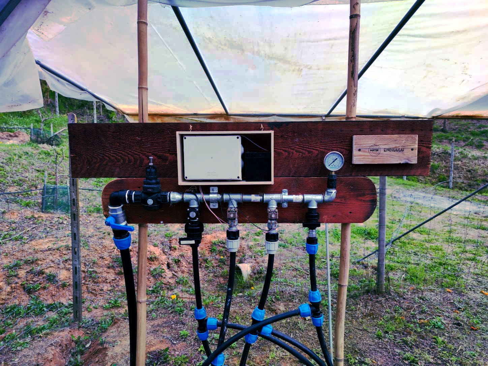

## NBLulu

Enbilulu è un sistema di irrigazione intelligente sviluppato come prova di concetto presso Mater. Questo sistema è una soluzione pratica fai-da-te a basso costo per una gestione precisa dell'acqua in agricoltura.

Enbilulu sfrutta tecnologie semplici per migliorare l'efficienza dell'irrigazione.

### Comprendere Enbilulu

Enbilulu opera sul principio di utilizzare temperatura e umidità per stimare la perdita d'acqua attraverso un processo noto come [evapotraspirazione](https://en.wikipedia.org/wiki/Evapotranspiration).

#### Evapotraspirazione Semplificata

L'evapotraspirazione è la somma dell'evaporazione dalla superficie del suolo più la traspirazione dalle foglie delle piante. Essenzialmente, rappresenta quanta acqua viene persa nell'atmosfera dal suolo e dalle piante. Comprendere questo processo è cruciale per un'irrigazione accurata.

#### Il Ruolo di Enbilulu

Stimando la quantità di acqua persa tramite evapotraspirazione, Enbilulu può calcolare con precisione l'esatta quantità di acqua necessaria per il reintegro. Questo sistema intelligente è implementato utilizzando un server (come un Raspberry Pi o un PC a basse specifiche) e un setup microcontrollore-elettrovalvola.

### Sperimentare con Enbilulu: il progetto GOING

La vera prova dell'efficacia di Enbilulu è arrivata con un esperimento presso l'azienda agricola [Il Bosco Giardino](http://ilboscogiardino.com/). L'attenzione era focalizzata sull'osservazione degli effetti di diversi regimi di irrigazione deficitaria su tre diverse varietà di pomodoro.

#### Tecnica di Irrigazione Deficitaria

Questa tecnica implica l'applicazione di meno acqua rispetto al tasso completo di evapotraspirazione, stressando strategicamente le piante. È un metodo noto per migliorare potenzialmente la qualità di certe colture, come i pomodori.

#### Impostazione dell'Esperimento

Utilizzando Enbilulu, l'esperimento ha applicato il 50%, 75% e 100% dei fabbisogni calcolati di evapotraspirazione delle colture alle piante di pomodoro. Questo approccio ha permesso un'analisi dettagliata di come livelli variabili di stress idrico influenzano la crescita, la resa e la qualità di diverse varietà di pomodoro.

### Implicazioni e Approfondimenti

L'esperimento Enbilulu non solo mostra la capacità del sistema di fornire un'irrigazione precisa ma apre anche una nuova prospettiva **sull'uso dello stress idrico come strumento per migliorare la qualità delle colture** (vedi [irrigazione deficitaria](https://en.wikipedia.org/wiki/Deficit_irrigation)). Questo sistema di irrigazione intelligente esemplifica come soluzioni a bassa tecnologia, basate su ricerche scientifiche consolidate, possono portare a significativi miglioramenti nelle pratiche agricole. La sua capacità di bilanciare l'uso dell'acqua con le esigenze delle colture non solo conserva una risorsa essenziale ma apre anche la strada alla produzione di colture di qualità superiore.
